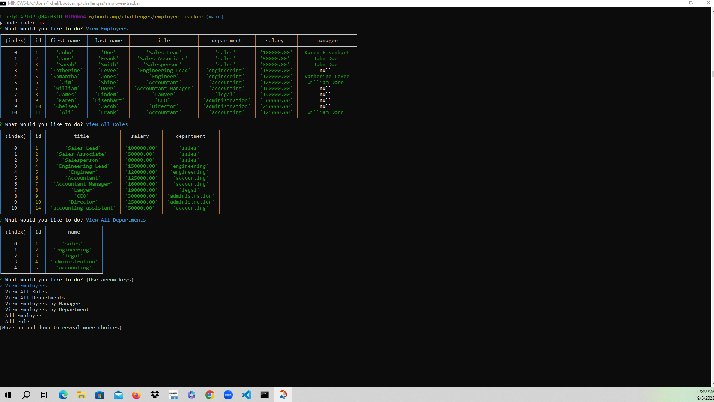
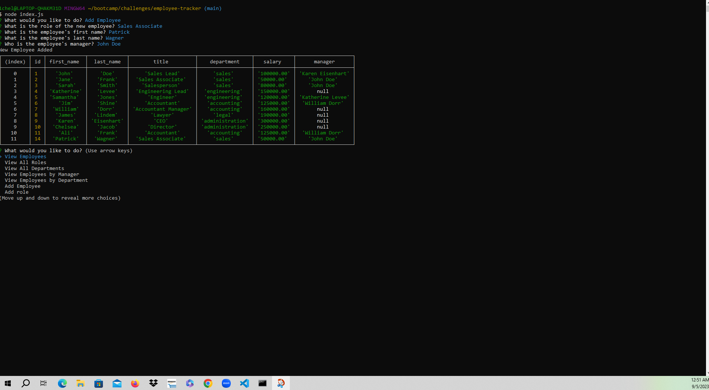

# Employee Tracker

# Description
    -This project involved creating an employee tracker.
    -The Employee Tracker runs in the terminal.
    -As the user answers questions in the terminal different actions occur based on user input.
    -Some of the options for a user include adding an employee, role or department, viewing a list of employees, roles or departments, and updating or deleting different aspects of the table.
       
    
# Installation
    -In order to install this project the user must go to the terminal and type in "node index.js" then follow the prompts on the screen.
    -To exit the application the user will go to the exit option.

    -Follow the following URL to the video that demonstrates installation and usage: 
    
    
# Usage
    

   
    - This image is the result of inputting the command line with "node index.js".
    - Following the initial command, this shows the results of the user requesting to view the three tables: employees, roles and departments.

   
    
    -   This image occurs after inputting the command of "node index.js"
    -   After the inital command, this shows the results of adding an employee to the employees database 

# Credits
    Donnie Rawlings: https://github.com/drawlin22/
    Kyle Jocoy: https://github.com/Kylyote/
    Nedda Elsayed: https://github.com/Lven-Nemsy
    AskBCS Royce Ojwilli to help with displaying the employee table and adding a role.
    Tutor Neil Dhand to help with updating employees and adding new employees.
    
   
   
# License
    MIT

